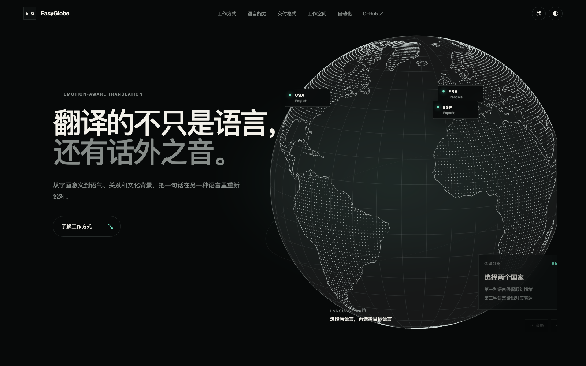
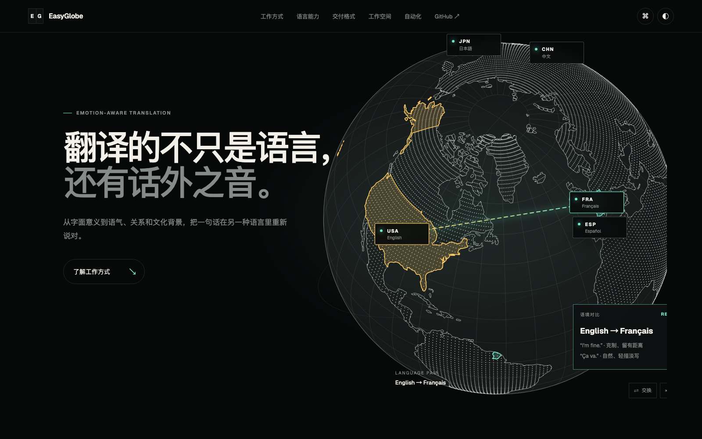
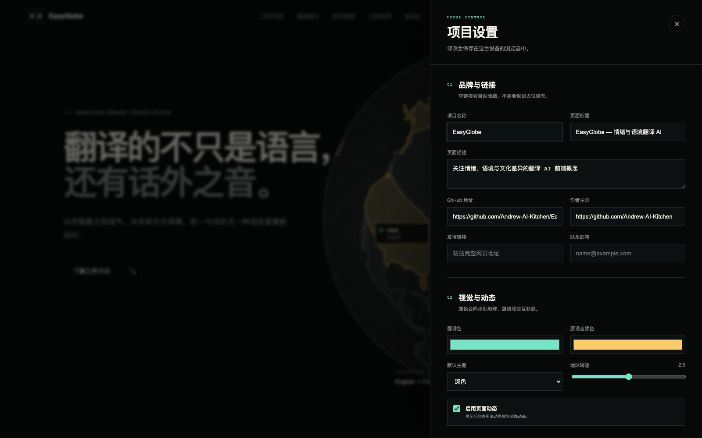
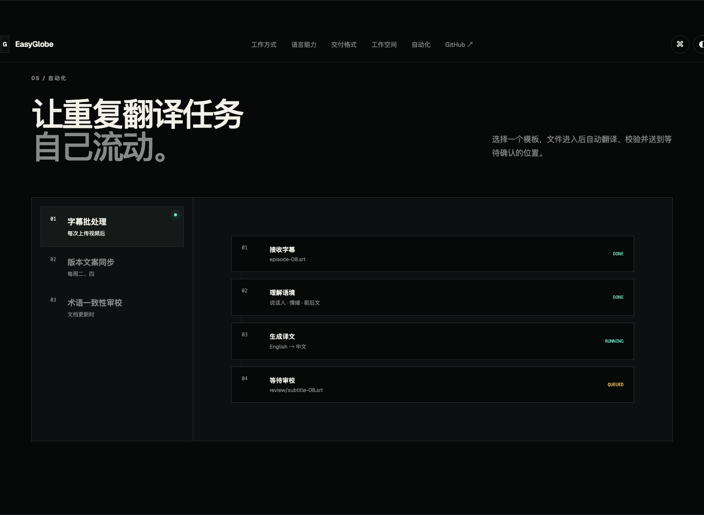

# EasyGlobe

English | [简体中文](README.zh-CN.md)

An artistic frontend study built around an interactive dotted globe, language routes, and a configurable editorial interface.


[Live demo](https://andrew-ai-kitchen.github.io/EasyGlobe/) · [Desktop guide](docs/GITHUB-DESKTOP.md) · [Creator](https://github.com/Andrew-AI-Kitchen)



## Why

EasyGlobe is a from-scratch frontend learning project focused on the visual and interaction techniques behind a high-end product landing page. Its translation-oriented copy is a demonstration theme; the project itself is about frontend craft:

- a canvas-rendered orthographic globe
- country labels bound to geographic coordinates
- animated routes between selected languages
- restrained motion, typography, spacing, and responsive composition
- a no-code settings panel for changing the presentation

It is a static frontend. There is no translation model, user account system, database, analytics, or business backend.

## Highlights

- **Interactive dotted globe** — drag to rotate, inspect countries, and select a language pair.
- **Geographic labels** — labels follow projected coordinates and disappear on the far side of the globe.
- **Animated language routes** — selected countries receive distinct colors and a moving connection line.
- **Configurable presentation** — change branding, links, theme, colors, motion, globe speed, and country copy in the browser.
- **Local-first settings** — settings stay in browser storage and can be exported or imported as JSON.
- **Responsive editorial UI** — landing sections, tabs, workspace previews, automation flows, FAQ, and mobile navigation.
- **Portable launchers** — one-click helpers for macOS, Windows, and Linux.
- **GitHub Pages ready** — relative paths, no build step, and `.nojekyll` included.

## Screenshots

### Globe and visual direction


### Language selection and animated route



### Visual settings panel



### Workspace and automation presentation



## Run locally

Python 3 is the only prerequisite. The launcher finds an available local port and opens the default browser.

| Platform | Start |
|---|---|
| macOS | Double-click `Start EasyGlobe.command`. If macOS blocks it the first time, right-click and choose **Open**. |
| Windows | Double-click `start-easyglobe.cmd`. |
| Linux | Run `./start-easyglobe.sh`. |

Universal fallback:

```bash
python3 launcher.py
```

Keep the terminal window open while using the site. Press `Ctrl+C` to stop it. Opening `index.html` directly with `file://` is not supported because browsers restrict module and configuration loading in that mode.

## Customize

Select the `⌘` control in the top-right corner to open the settings panel. It can edit:

- project name, title, description, and links
- light, dark, or system theme
- route and source-language colors
- page motion and globe rotation speed
- visible countries, language names, samples, and tone notes

Settings are stored only in the current browser. Export the JSON file before clearing browser data or moving to another device.

Default values are also available in:

```text
config/site.json
config/languages.json
config/content.zh-CN.json
```

## Publish with GitHub Desktop

The prepared folder can be added directly to GitHub Desktop. Follow the complete instructions in [docs/GITHUB-DESKTOP.md](docs/GITHUB-DESKTOP.md).

For GitHub Pages, publish from the `main` branch and repository root. The resulting project URL is expected to be:

```text
https://andrew-ai-kitchen.github.io/EasyGlobe/
```

## Project structure

```text
EasyGlobe/
├── index.html
├── rebuild.css
├── rebuild.js
├── assets/
├── config/
├── docs/
│   └── screenshots/
├── launcher.py
├── Start EasyGlobe.command
├── start-easyglobe.cmd
├── start-easyglobe.sh
├── README.md
└── README.zh-CN.md
```

## Scope and limitations

- This is a frontend interaction concept, not a production translation service.
- The settings panel stores data per browser and does not write back to repository files.
- Country coverage is intentionally limited to a small demonstration set.
- Python is used only to serve static files locally; it is not an application backend.
- GitHub Pages serves the static experience, but cannot provide server-side features.

## Design study note

EasyGlobe is an independent, from-scratch implementation created for frontend learning. The landing-page presentation was studied with reference to [LangAlpha](https://langalpha.ai/zh-cn/home). EasyGlobe does not include its source code, logo, business identity, or service implementation, and is not affiliated with or endorsed by LangAlpha.

## Third-party materials

EasyGlobe uses D3.js, the Geist typeface, and public-domain Natural Earth geographic data. See [THIRD_PARTY_NOTICES.md](THIRD_PARTY_NOTICES.md) for details.

## License

No open-source license has been granted for the EasyGlobe project at this stage. The source is published for learning and review. Third-party components remain under their respective licenses.
